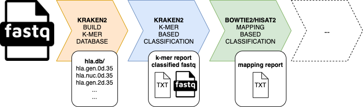

# quickhla

## About

`quickhla` is inspired by [https://github.com/ExpressionAnalysis/HLAProfiler](https://github.com/ExpressionAnalysis/HLAProfiler)
and [https://sourceforge.net/projects/targt-pipeline/](https://sourceforge.net/projects/targt-pipeline/)
to use k-mer content of next generation sequencing reads and subsequent mapping to classify HLA types in a sample.

`quickhla` heavily relies on the data from the [IPD-IMGT/HLA](https://www.ebi.ac.uk/ipd/imgt/hla/) database.



## Usage

First, the HLA k-mer databases need to be build (can take up to 30 minutes):

```bash
# download hla fasta files from ftp://ftp.ebi.ac.uk/pub/databases/ipd/imgt/hla/fasta/
wget ftp://ftp.ebi.ac.uk/pub/databases/ipd/imgt/hla/fasta/hla_gen.fasta
wget ftp://ftp.ebi.ac.uk/pub/databases/ipd/imgt/hla/fasta/hla_nuc.fasta
# build databases with k-mer length of 35
quickhla build -gen hla_gen.fasta -nuc hla_nuc.fasta
# build databases with k-mer length of 35 using 12 threads
quickhla build -gen hla_gen.fasta -nuc hla_nuc.fasta -t 12
```

see help

```
quickhla build -h

usage: quickhla <sub-script> [options] [<arguments>...] build
       [-h] [-gen GEN] [-nuc NUC] [-o O] [-kb KB] [-bb BB] [-hb HB] [-kl KL]
       [-ml ML] [-ms MS]

optional arguments:
  -h, --help  show this help message and exit
  -gen GEN    input gen file [mandatory]
  -nuc NUC    input nuc file [mandatory]
  -o O        output kraken2 database directory [default: hla.db]
  -kb KB      specify kraken2-build binary [if not given assumes to be in
              PATH]
  -bb BB      specify bowtie2-build binary [if not given assumes to be in
              PATH]
  -hb HB      specify hisat2-build binary [if not given assumes to be in PATH]
  -kl KL      kraken2 kmer-len array [default: 35] can be an array of values
              and needs to be same length as -ml and -ms
  -ml ML      kraken2 minimizer-len array [default: 31] if array needs to be
              same length as -kl and -ms
  -ms MS      kraken2 minimizer-space array [default: 7] if array needs to be
              same length as -kl and -ml
  -t T        specify number threads [default: 1]
```

One can also create the consensus sequences for the different digit levels and use this files as the database.

```
mkdir msf
cd msf
wget -A msf -l 1 -r -nd --no-parent ftp://ftp.ebi.ac.uk/pub/databases/ipd/imgt/hla/msf/
quickhla msf -i .
cd ..
quickhla build -gen msf/gen_2d.consensus.fasta -nuc msf/nuc_2d.consensus.fasta -t 12 -o msf.db
```

For paired reads `FORWARD.fq` and `REVERSE.fq` using the standard `nuc` database created for four-digits `4d` , the basic usage is:

```bash
quickhla classify -f FORWARD.fq -r REVERSE.fq -d hla.db -db hla.nuc.4d.35 -n 4 -t 12
```

see help

```
quickhla classify -h

usage: quickhla <sub-script> [options] [<arguments>...] classify
       [-h] [-f F] [-r R] [-d D] [-db DB] [-o O] [-t T] [-kb KB] [-alg ALG]
       [-bb BB] [-bo BO] [-hb HB] [-ho HO] [-n N]

optional arguments:
  -h, --help  show this help message and exit
  -f F        specify forward fastq [mandatory]
  -r R        specify reverse fastq [mandatory]
  -d D        specify db directory [mandatory]
  -db DB      specify db for classification [mandatory]
  -o O        specify output prefix [default: out]
  -t T        specify number threads [default: 1]
  -kb KB      specify kraken2 binary [if not given assumes to be in PATH]
  -alg ALG    specify aligner [default: hisat2]
  -w          apply weights on read counts [default: False]
  -bb BB      specify bowtie2 binary [if not given assumes to be in PATH]
  -bo BO      specify bowtie2 options [default: --very-fast --no-unal
              -k 1000]
  -hb HB      specify hisat2 binary [if not given assumes to be in PATH]
  -ho HO      specify hisat2 options [default: --fast -k 1000]
  -n N        specify number of top hits to report [default: show all]
```

## Output

quickhla outputs two plain text files with the HLA classifications (1. from k-mer and 2. from mapping)

The output are:

1. k-mer results (number of fragments per class)

Example shows the top 2 hits per HLA class `out.hla.nuc.4d.35.report`

```
#quickhla classify -f SRR099966_1.filt.fastq.gz -r SRR099966_2.filt.fastq.gz -d hla.db -db hla.nuc.4d.35 -n 4 -t 12
 99.90  99117470        99117470        U       0       unclassified
  0.10  98293   10992   R       1       hlaroot
  0.01  10824   2831    K       2         A
  0.00  2464    196     P       1424        A*02
  0.00  356     356     C       1425          A*02:01
  0.00  276     276     C       4832          A*02:874
  0.00  944     13      P       8499        A*24
  0.00  212     212     C       8500          A*24:02
  0.00  56      56      C       9843          A*24:371

  0.01  10476   3261    K       16304     B
  0.00  1155    91      P       29130       B*44
  0.00  471     471     C       29320         B*44:03
  0.00  75      75      C       30293         B*44:329
  0.00  821     9       P       16305       B*07
  0.00  133     133     C       16306         B*07:02
  0.00  87      87      C       17422         B*07:338

  0.01  10549   2352    K       36025     C
  0.00  2833    388     P       43684       C*07
  0.00  455     455     C       43984         C*07:02
  0.00  135     135     C       43685         C*07:01
  0.00  1274    70      P       37661       C*03
  0.00  254     254     C       39237         C*03:418
  0.00  196     196     C       37885         C*03:04 

  0.01  8596    1785    K       68214     DQB1
  0.00  2114    247     P       68874       DQB1*03
  0.00  206     206     C       68875         DQB1*03:01
  0.00  117     117     C       70083         DQB1*03:369
  0.00  1602    297     P       70844       DQB1*05
  0.00  205     205     C       70943         DQB1*05:02
  0.00  165     165     C       70845         DQB1*05:01

  0.01  6789    2058    K       51886     DRB1
  0.00  592     14      P       58657       DRB1*15
  0.00  85      85      C       58889         DRB1*15:114
  0.00  68      68      C       58832         DRB1*15:08
  0.00  543     107     P       53018       DRB1*04
  0.00  44      44      C       53163         DRB1*04:05
  0.00  34      34      C       53892         DRB1*04:286N  
```

2. mapping results (number of reads per class)

Example shows the top 4 hits per HLA class and digit level `out.hla.nuc.4d.35.class.txt`

```
#quickhla classify -f SRR099966_1.filt.fastq.gz -r SRR099966_2.filt.fastq.gz -d hla.db -db hla.nuc.4d.35 -n 4 -t 12
A	311503
        A*01	122814
        A*11	77905
        A*03	73636
        A*30	31114
        	A*01:01	48306
        	A*03:01	27812
        	A*11:01	27718
        	A*30:02	5378
        		A*01:01:01      24741
        		A*03:01:01      16294
        		A*11:01:01      14110
        		A*30:02:01      3309
        			A*01:01:71:NA   488
        			A*01:251:NA:NA  343
        			A*01:01:01:24   342
        			A*01:342:NA:NA  341
B       143234
        B*15    27971
        B*08    22800
        B*57    16677
        B*44    9919
        	B*08:01 7046
        	B*57:01 5946
        	B*15:01 4297
        	B*18:01 3710
        		B*08:01:01      3665
        		B*18:01:01      2500
        		B*57:01:01      2434
        		B*15:01:01      2236
        			B*57:03:04:NA   144
        			B*57:01:01:14   127
        			B*57:01:01:20   127
        			B*57:99:NA:NA   127
C       280304
        C*07    193392
        C*06    33631
        C*12    18817
        C*05    10718
        	C*07:01 37102
        	C*07:02 36435
        	C*06:02 11190
        	C*07:04 5048
        		C*07:01:01      21353
        		C*07:02:01      20340
        		C*06:02:01      4978
        		C*05:01:01      2533
        			C*07:02:01:17N  230
        			C*07:777:NA:NA  223
        			C*07:01:01:47   222
        			C*07:109:02:NA  222
DQB1    92545
        DQB1*03 43277
        DQB1*02 27180
        DQB1*04 10886
        DQB1*06 10320
        	DQB1*02:01      5047
        	DQB1*03:02      4872
        	DQB1*03:03      4636
        	DQB1*03:01      3725
        		DQB1*03:02:01   1718
        		DQB1*03:01:01   1535
        		DQB1*04:02:01   1409
        		DQB1*02:02:01   1081
        			DQB1*02:59:NA:NA        254
        			DQB1*02:01:01:01        253
        			DQB1*02:01:01:04        250
        			DQB1*02:01:01:02        249
DRB1    272859
        DRB1*13 48947
        DRB1*11 47441
        DRB1*03 36771
        DRB1*14 36447
        	DRB1*07:01      8146
        	DRB1*03:01      7646
        	DRB1*11:01      7551
        	DRB1*13:01      7468
        		DRB1*14:54:01   4685
        		DRB1*13:02:01   4060
        		DRB1*13:01:01   3660
        		DRB1*09:01:02   3330
        			DRB1*09:01:02:05        668
        			DRB1*07:01:01:04        667
        			DRB1*07:01:01:05        667
        			DRB1*09:01:02:02        667
```

## Third-party Dependencies

quickhla requires:

- kraken2 [https://ccb.jhu.edu/software/kraken2/](https://ccb.jhu.edu/software/kraken2/)
- bowtie2 [http://bowtie-bio.sourceforge.net/bowtie2/index.shtml](http://bowtie-bio.sourceforge.net/bowtie2/index.shtml)
- hisat2 [https://daehwankimlab.github.io/hisat2/](https://daehwankimlab.github.io/hisat2/)
- biopython [https://biopython.org/](https://biopython.org/)
- numpy [https://numpy.org/](https://numpy.org/)

You can install them manually (see individual download pages):

- kraken2 [https://github.com/DerrickWood/kraken2](https://github.com/DerrickWood/kraken2)
- bowtie2 [https://sourceforge.net/projects/bowtie-bio/files/bowtie2/2.4.2](https://sourceforge.net/projects/bowtie-bio/files/bowtie2/2.4.2)
- hisat2 [https://daehwankimlab.github.io/hisat2/download/](https://daehwankimlab.github.io/hisat2/download/)
- biopython [https://biopython.org/wiki/Download](https://biopython.org/wiki/Download)
- numpy [https://numpy.org/install/](https://numpy.org/install/)

Or you can install them via conda:

- kraken2 [https://anaconda.org/bioconda/kraken2](https://anaconda.org/bioconda/kraken2)
- bowtie2 [https://anaconda.org/bioconda/bowtie2](https://anaconda.org/bioconda/bowtie2)
- hista2 [https://anaconda.org/biobuilds/hisat2](https://anaconda.org/biobuilds/hisat2)
- biopython [https://anaconda.org/anaconda/biopython](https://anaconda.org/anaconda/biopython)
- numpy [https://anaconda.org/anaconda/numpy](https://anaconda.org/anaconda/numpy)

```
conda install -c bioconda kraken2
conda install -c bioconda bowtie2
conda install -c biobuilds hisat2
conda install -c anaconda biopython
conda install -c anaconda numpy
```

## Installation

### via Conda

### PyPI

### Manually

```bash
git clone https://gitlab.gwdg.de/kristian.ullrich/quickhla.git
cd quickhla
python setup.py install
```

### Manually in conda env

```bash
conda create -n quickhla python=3.8
conda activate quickhla
conda install -c bioconda kraken2
conda install -c bioconda bowtie2
conda install -c biobuilds hisat2
conda install -c anaconda biopython
conda install -c anaconda numpy
git clone https://gitlab.gwdg.de/kristian.ullrich/quickhla.git
cd quickhla
python setup.py install
```

## Example

Test HLA typing for individuals from [https://www.internationalgenome.org/](https://www.internationalgenome.org/)

```
# download test data
wget ftp://ftp.1000genomes.ebi.ac.uk/vol1/ftp/phase3/data/HG00100/sequence_read/SRR099966_1.filt.fastq.gz
wget ftp://ftp.1000genomes.ebi.ac.uk/vol1/ftp/phase3/data/HG00100/sequence_read/SRR099966_2.filt.fastq.gz
# classify reads - top 4 hits
quickhla classify -f SRR099966_1.filt.fastq.gz -r SRR099966_2.filt.fastq.gz -d hla.db -db hla.nuc.4d.35 -n 4 -t 12
# classify reads - top 4 hits - read counts weighted
quickhla classify -f SRR099966_1.filt.fastq.gz -r SRR099966_2.filt.fastq.gz -d hla.db -db hla.nuc.4d.35 -n 4 -t 12 -w
```

## Known Issues

## Contributing Code

If you would like to contribute to CRBHits, please file an issue so that one can establish a statement of need, avoid redundant work, and track progress on your contribution.

Before you do a pull request, you should always file an issue and make sure that someone from the CRBHits developer team agrees that it’s a problem, and is happy with your basic proposal for fixing it.

Once an issue has been filed and we've identified how to best orient your contribution with package development as a whole, [fork](https://docs.github.com/en/github/getting-started-with-github/fork-a-repo) the [main repo](https://gitlab.gwdg.de/kristian.ullrich/quickhla), branch off a [feature branch](https://docs.github.com/en/github/collaborating-with-issues-and-pull-requests/about-branches) from `master`, [commit](https://docs.github.com/en/desktop/contributing-and-collaborating-using-github-desktop/committing-and-reviewing-changes-to-your-project) and [push](https://docs.github.com/en/github/using-git/pushing-commits-to-a-remote-repository) your changes to your fork and submit a [pull request](https://docs.github.com/en/github/collaborating-with-issues-and-pull-requests/proposing-changes-to-your-work-with-pull-requests) for `quickhla:master`.

By contributing to this project, you agree to abide by the Code of Conduct terms.

## Bug reports

Please report any errors or requests regarding [quickhla](https://gitlab.gwdg.de/kristian.ullrich/quickhla) to Kristian Ullrich (ullrich@evolbio.mpg.de)

or use the issue tracker at [https://gitlab.gwdg.de/kristian.ullrich/quickhla/issues](https://gitlab.gwdg.de/kristian.ullrich/quickhla/issues)

## Code of Conduct - Participation guidelines

This repository adhere to [Contributor Covenant](http://contributor-covenant.org) code of conduct for in any interactions you have within this project. (see [Code of Conduct](https://gitlab.gwdg.de/kristian.ullrich/quickhla/-/blob/master/CODE_OF_CONDUCT.md))

See also the policy against sexualized discrimination, harassment and violence for the Max Planck Society [Code-of-Conduct](https://www.mpg.de/11961177/code-of-conduct-en.pdf).

By contributing to this project, you agree to abide by its terms.

## References

1. Buchkovich M.L., Brown C.C., Robasky K., Chai S., Westfall S., Vincent B.G., Weimer E.T., Powers J.G. (2017)
   **HLAProfiler utilizes k-mer profiles to improve HLA calling accuracy for rare and common alleles in RNA-seq data.**
  *Genome Med*, **9, 86**. 
   [https://doi.org/10.1186/s13073-017-0473-6](https://doi.org/10.1186/s13073-017-0473-6)

2. Pierini F., Nutsua M., Böhme L., Özer O., Bonczarowska J., Susat J., Franke A., Nebel A., Krause-Kyora B., Lenz T.L. (2020)
   **Targeted analysis of polymorphic loci from low-coverage shotgun sequence data allows accurate genotyping of HLA genes in historical human populations.**
   *Sci Rep*, **10, 7339**. [https://doi.org/10.1038/s41598-020-64312-w](https://doi.org/10.1038/s41598-020-64312-w)

3. Robinson J., Barker D.J., Georgiou X., Cooper M.A., Flicek P., Marsh S.G.E. (2020)
   **IPD-IMGT/HLA Database**
   *Nucleic Acids Research*, **48(D1), D948–D955**. [https://doi.org/10.1093/nar/gkz950](https://doi.org/10.1093/nar/gkz950)

